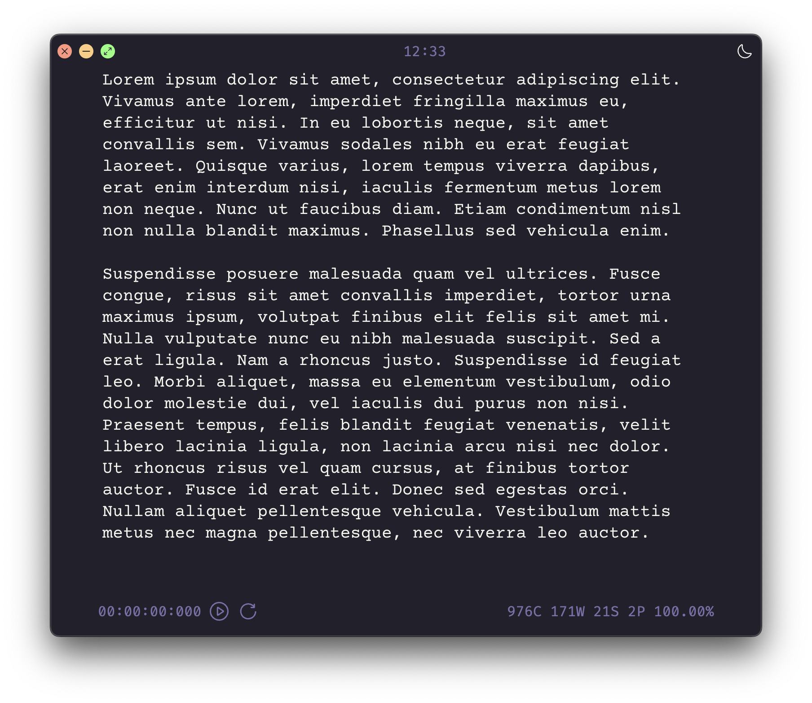
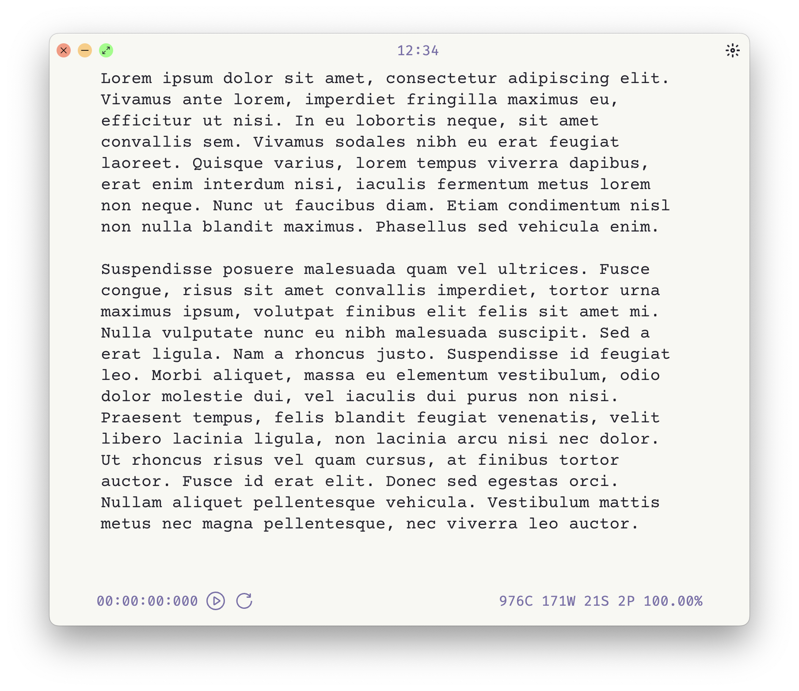

# Writer

Writer is a distraction-free text editor to improve your writing skills. It includes statistics, stopwatch, dark/light theme and many other little tricks to make your writing experience more pleasant.

I started this project to help myself to improve my writing skills, especially IELTS writing part. While I was experimenting with many tools and approaches, I discovered that the best way to level-up is to completely eliminate any grammar and spellcheckers and focus solely on the process of writing. Unfortunately, I couldn't find the right app for me because al of them either they had bad design/interface, IMHO, or they were bloated with unnecessary futures or spellcheckers.

The app has statistics that shows how many characters, word, sentences or paragraphs you have written. It's helpful when you're trying to meet some goals, for example, at least 250 words for IELTS essay part. Also, the app has a stopwatch that you can use to track you writing speed or create the pressure to emulate exam conditions.




## Prerequisites

You must have `nodejs` >= 18 and `npm` >= 9 to run and build this app. Work with early versions is not guaranteed.

## Install

```bash
git clone https://github.com/stoope/writer.git
npm install
```

## Run

```bash
npm run start
```

## Build

You might have to change the `electron-forge` configuration file `forge.config.cjs` to build the app for your specific platform.

```bash
npm run build
```

After build you could find the app under `out` folder.

## Your help is appreciated!

If you want to discuss your ideas or create a MR Pull Requests you're welkome!
